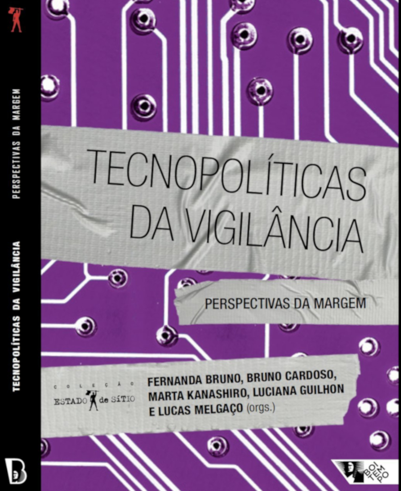
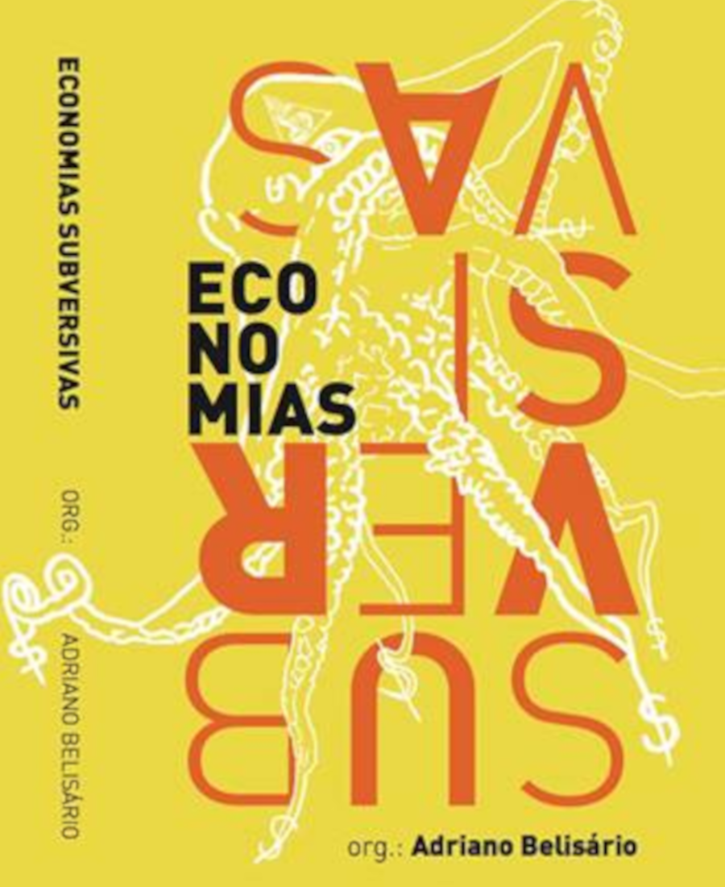
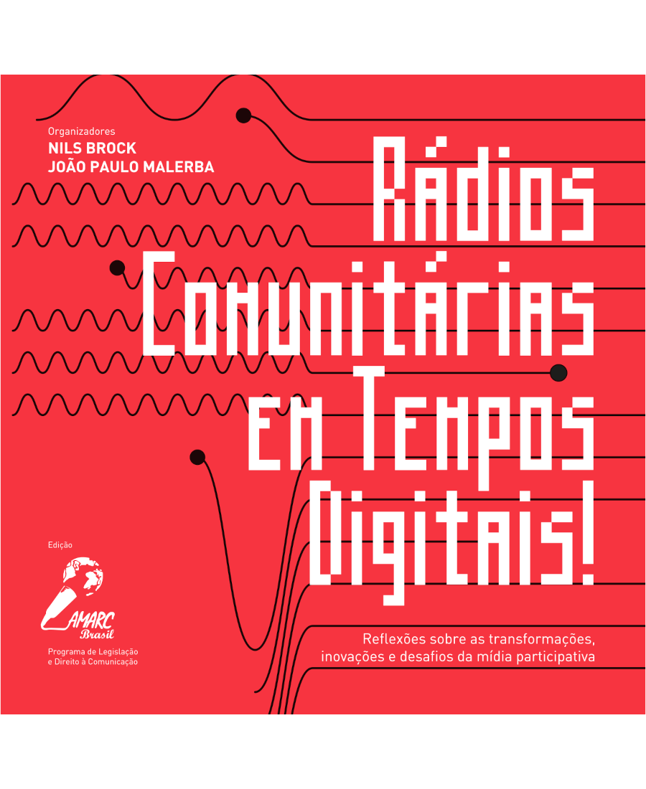
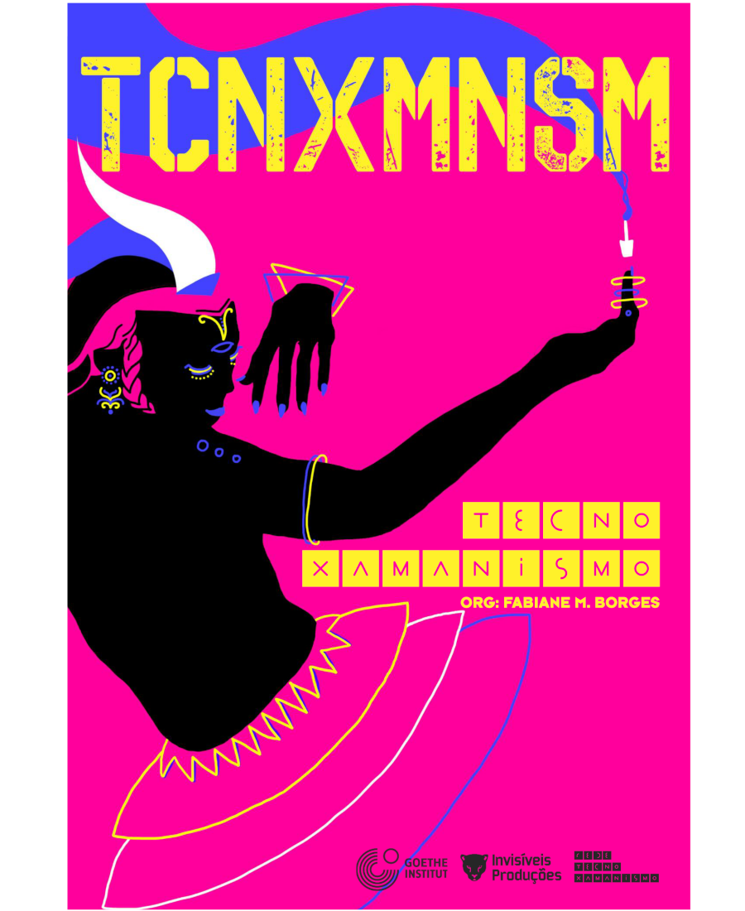
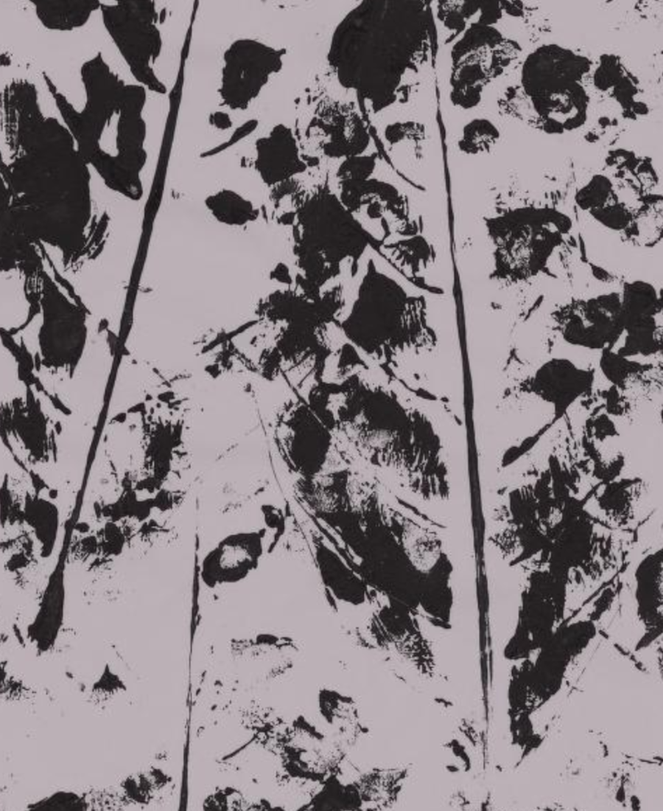
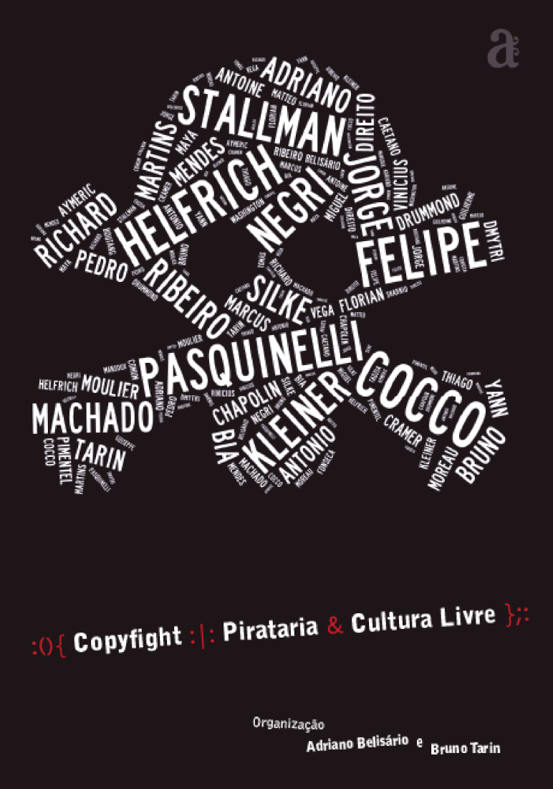
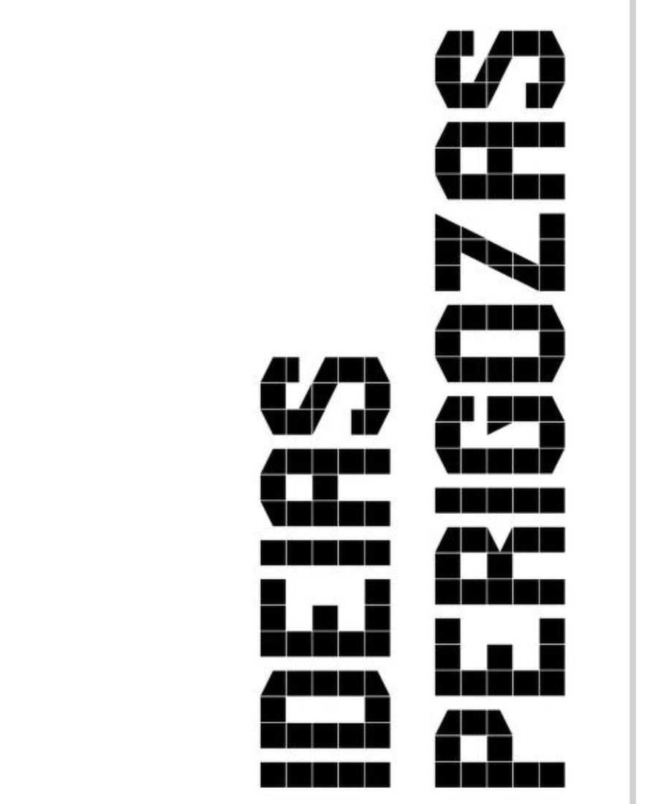
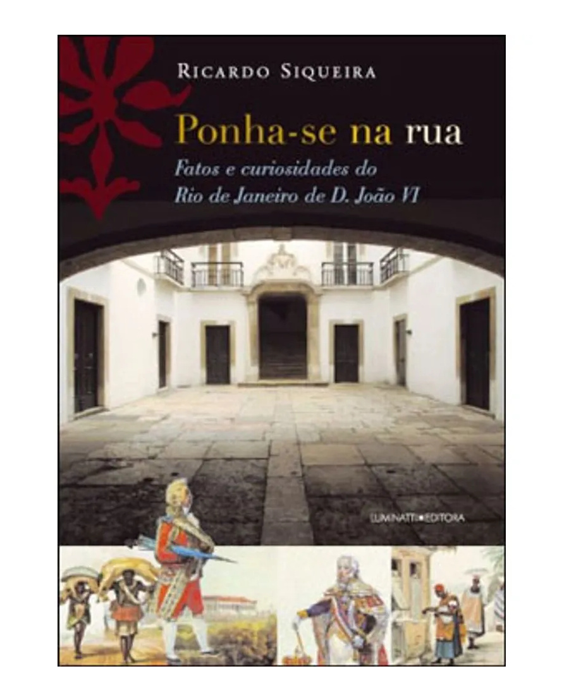

# [PUBLICATIONS]{.third-color}

Here are the main texts I've published since 2008. These include data-driven investigations and articles published in English, along with books, academic articles, journalistic investigations, and tutorials in Portuguese.

⭐  highlights
🌐  multi-language

# Works in English

[**Tutorial on survey data based on the report "Venezuelan Migrants and Refugees in Chile, Colombia, Ecuador, and Peru: A Development Opportunity"**]. To be published. 2024. Authorship.

⭐ [**Into the crossfire: Evaluating the use of a language model to crowdsource gun violence reports**](https://arxiv.org/abs/2401.12989). arXiv preprint, 2024. Co-authorship with Scott Hale and Luc Rocher.

⭐ [**Analyzing Misinformation Claims During the 2022 Brazilian General Election on WhatsApp, Twitter, and Kwai**](https://arxiv.org/abs/2401.02395). arXiv preprint, 2024. Co-authorship with Scott Hale, Ahmed Mostafa and Chico Camargo.

⭐ [**Territories of Exception: Violation of rights and the use of police helicopters in Rio de Janeiro**](https://documental.xyz/intervencao). Documental.xyz, 2021. Coordination, authorship, data analysis and visualization. Also published in [Portuguese](https://documental.xyz/pt/intervencao) and [Spanish](https://documental.xyz/es/intervencao). 🌐

[**Expulsions - Forced displacements and archaeological destruction by the mega-mining project Mirador in the Ecuadorian Amazonia**](https://documental.xyz/expulsions). Documental.xyz, 2020. Research and data analysis. Also published in [Portuguese](https://documental.xyz/pt/expulsions) and [Spanish](https://documental.xyz/es/expulsions). 🌐

[**Rio goes live: video activism and human rights in Brazil**](https://lab.witness.org/rio-goes-live/). Witness, 2019. Authorship.

[**Free spectrum and freedom of expression in the 21st century**](https://www.apc.org/en/news/free-spectrum-and-freedom-expression-21st-century). Association for Progressive Communications, 2018. Authorship.

[**Activism in landscapes: culture, spectrum and Latin America**](https://spheres-journal.org/contribution/activism-in-landscapes-culture-spectrum-and-latin-america/). Spheres - Journal for Digital Cultures, 2016. Co-authorship With Paulo Lara and Francisco Caminati.

# Portuguese

## Books and published writing

::: {layout-ncol=2}

{group="my-gallery" height=300 class="mx-3"}

{group="my-gallery" height=300} 

{group="my-gallery"}

{group="my-gallery"}

{group="my-gallery"}

{} 

{group="my-gallery"}

{group=my-gallery} 

{group="my-gallery"}

{group=my-gallery} 

:::

## Academic papers

BELISARIO, ADRIANO. [**A Terra à Vista**](https://periodicos.unb.br/index.php/dasquestoes/article/view/18647/17367). DAS QUESTÕES, v. 6, p. 1, 2018.

ZASSO, MARIEL ROSAURO ; POPPI, RICARDO ; KONOPACKI, MARCO ANTONIO ; BELISARIO, ADRIANO ; ASTORQUIZA, LUIS ; BEJARANO, PABLO ; SALLAS, NORMA RUIZ ; YAÑEZ FIGUEROA, JOSÉ ANTONIO. [**Caixa Mágica: chronicle of a civic innovation project**](https://revista.ibict.br/liinc/article/view/3747/3222). LIINC EM REVISTA, v. 13, p. 237, 2017.

⭐ LARA, Paulo José O. M. ; BELISARIO, Adriano. [**Communication, surveillance and infrastructure: techno-politics of the electromagnetic spectrum**.](https://revista.ibict.br/liinc/article/view/3722) Liinc em Revista, v. 12, p. 271-285, 2016.

BELISARIO, Adriano.; FERREIRA, P. P. [**Perspectivas Tecnoxamânicas e tecnomágicas no ativismo digital brasileiro recente: uma trajetória possível**](https://www.contemporanea.ufscar.br/index.php/contemporanea/article/view/434). Contemporânea, v. 6, p. 335-367, 2016.

BELISARIO, Adriano. [**Tecnoxamanismo: por uma cibernética insurgente**](https://revistas.ufrj.br/index.php/lc/article/view/50155). Lugar Comum (UFRJ), v. 43, p. 265, 2015.

BELISARIO, Adriano. [**Espectro livre como alternativa tecnopolítica à vigilância**](https://politics.org.br/edicoes/espectro-livre-como-alternativa-tecnopol%C3%ADtica-%C3%A0-vigil%C3%A2ncia). Politics (Impresso), v. 1, p. 15, 2015.

BELISARIO, Adriano; LOPES, Juliana. [**Políticas públicas de cultura digital: dos Pontos de Cultura à reinvenção do Estado**](http://www.viii.enecult.ufba.br/modulos/consulta&relatorio/rel_download.asp?nome=41478.pdf)

BENTES, Ivana ; CASTRO, O. ; BARRETO, G. ; UCHOAS, L. ; BELISÁRIO, Adriano. **Midialivristas, uni-vos!**. Lugar Comum (UFRJ), v. 25-26, p. 137-141, 2009.

## Journalistic articles

[A tropa de choque de Bolsonaro no Congresso](https://apublica.org/2019/01/a-tropa-de-choque-de-bolsonaro-no-congresso/). Agência Pública. 2019.

⭐ [Como vota Rio das Pedras, reduto da mais antiga milícia carioca](https://apublica.org/2019/02/como-vota-rio-das-pedras-reduto-da-mais-antiga-milicia-carioca/). Agência Pública. 2019.

[Não há registro de entrada na Câmara para assessor de Bolsonaro investigado pela Justiça](https://apublica.org/2019/05/nao-ha-registro-de-entrada-na-camara-para-assessor-de-bolsonaro-investigado-pela-justica/). Agência Pública. 2019.

[Dois assessores de Jair Bolsonaro doaram mais de R\$ 100 mil para campanhas da família](https://apublica.org/2019/03/dois-assessores-de-jair-bolsonaro-doaram-mais-de-r-100-mil-para-campanhas-da-familia/). Agência Pública. 2019.

[Encontramos mais cinco ex-assessoras de Bolsonaro que nem pisaram no Congresso](https://apublica.org/2019/04/encontramos-mais-cinco-ex-assessoras-de-bolsonaro-que-nem-pisaram-no-congresso/). Agência Pública. 2019.

[Operações do Exército no Rio geraram milhões para empresa da "farra do guardanapo"](https://www.intercept.com.br/2018/04/03/exercito-rio-empresa-investigada/). The Intercept Brasil. 2018.

[Sorteio do Supremo é caixa preta](https://apublica.org/2018/01/sorteio-do-supremo-e-caixa-preta/). Agência Pública. 2018.

[Documentos da CPI confirmam: Jacob Barata superfaturou aluguel de garagens no Rio](https://apublica.org/2018/02/documentos-da-cpi-confirmam-jacob-barata-superfaturou-aluguel-de-garagens-no-rio/). Agência Pública. 2018.

[Porto Maravilha corre o risco de parar novamente em 2018](https://apublica.org/2018/02/porto-maravilha-corre-o-risco-de-parar-novamente-em-2018/). Agência Pública. 2018.

[Liderada pelos EUA, importação de diesel bate recorde](https://apublica.org/2018/06/liderada-pelos-eua-importacao-de-diesel-bate-recorde/). Agência Pública. 2018.

[Operações do Exército no Rio geraram milhões para empresa da 'farra do guardanapo'](https://www.intercept.com.br/2018/04/03/exercito-rio-empresa-investigada/). The Intercept Brasil. 2018.

[Auditor: Sorteio de processos no Supremo é seguro pois guarda rastro de alterações](https://apublica.org/2018/09/auditor-sorteio-de-processos-no-supremo-e-seguro-pois-guarda-rastro-de-alteracoes/). Agência Pública. 2018.

[Semanalmente, juízes do Supremo decidem sozinhos sobre aplicação da Constituição](https://apublica.org/2018/09/semanalmente-juizes-do-supremo-decidem-sozinhos-sobre-aplicacao-da-constituicao/). Agência Pública. 2018.

[Presidente da Comissão de Transporte da Assembleia do Rio é sócio de diretor da Fetranspor foragido](https://apublica.org/2017/07/presidente-da-comissao-de-transporte-da-assembleia-do-rio-e-socio-de-diretor-da-fetranspor-foragido/). Agência Pública. 2017.

[As offshores dos empresários de ônibus presos na Lava Jato](https://apublica.org/2017/07/as-offshores-dos-empresarios-de-onibus-presos-na-lava-jato/). Agência Pública. 2017.

[O fiasco das CPIs dos ônibus no Rio de Janeiro](https://apublica.org/2017/08/o-fiasco-das-cpis-dos-onibus-no-rio-de-janeiro/). Agência Pública. 2017.

[Imobiliárias podem mascarar sobrelucro de empresários de ônibus](https://apublica.org/2017/08/imobiliarias-podem-mascarar-sobrelucro-de-empresarios-de-onibus/). Agência Pública. 2017.

[O BRT não resolveu](O%20BRT%20não%20resolveu). Agência Pública. 2017.

[Exclusivo: O que revela (e o que esconde) a auditoria oficial dos ônibus no Rio](https://apublica.org/2017/08/exclusivo-o-que-revela-e-o-que-esconde-a-auditoria-oficial-dos-onibus-no-rio/). Agência Pública. 2017.

⭐ [A teia dos donos do transporte no Rio](https://apublica.org/2017/08/a-teia-dos-donos-do-transporte-no-rio/). Agência Pública. 2017.

[Muito além dos Barata](https://apublica.org/2017/08/muito-alem-dos-barata/). Agência Pública. 2017.

[Mapeamento inédito mostra que doações legais da Odebrecht beneficiaram 1.087 candidatos desde 2002](https://www.intercept.com.br/2017/09/26/mapeamento-inedito-mostra-que-doacoes-legais-da-odebrecht-beneficiaram-1-087-candidatos-desde-2002/). The Intercept Brasil. 2017.

[Oposição recebeu menos de 2% de doações da Odebrecht para eleições nacionais nos anos 1990](https://www.intercept.com.br/2017/09/27/oposicao-recebeu-menos-de-2-de-doacoes-da-odebrecht-para-eleicoes-nacionais-nos-anos-1990/). The Intercept Brasil. 2017.

[Mesmo após Lava Jato, família Odebrecht manteve doações de campanha em 2016](https://www.intercept.com.br/2017/09/28/mesmo-apos-lava-jato-familia-odebrecht-manteve-doacoes-de-campanha-em-2016/). The Intercept Brasil. 2017.

[Auditoria inédita mostra prefeitura à mercê dos empresários de ônibus no Rio](https://apublica.org/2017/09/auditoria-inedita-mostra-prefeitura-a-merce-dos-empresarios-de-onibus-no-rio/). Agência Pública. 2017.

[Auditoria Cidadã prepara estudo sobre dívida do Rio](https://apublica.org/2016/11/auditoria-cidada-prepara-estudo-sobre-divida-do-rio/). Agência Pública. 2016.

[Documento da Lava Jato sugere cartel na Olimpíada](https://apublica.org/2016/04/documento-da-lava-jato-sugere-cartel-na-olimpiada/). Agência Pública. 2016.

[Engenharia financeira subvalorizou terrenos públicos no Porto Maravilha](https://apublica.org/2016/08/engenharia-financeira-subvalorizou-terrenos-publicos-no-porto-maravilha/). Agência Pública. 2016.

[Concremat: de 'braço auxiliar' das remoções à queda da ciclovia](https://apublica.org/2016/07/concremat-de-braco-auxiliar-das-remocoes-a-queda-da-ciclovia/). Agência Pública. 2016.

[A outra história do Porto Maravilha](https://apublica.org/2016/08/a-outra-historia-do-porto-maravilha/). Agência Pública. 2016.

[Desconto bilionário concedido a empresas é fator-chave no rombo do Rio](https://apublica.org/2016/11/desconto-bilionario-concedido-a-empresas-e-fator-chave-no-rombo-do-rio/). Agência Pública. 2016.

[As quatro irmãs](https://apublica.org/2014/06/as-quatro-irmas/). Agência Pública. 2014.

⭐ [Um jogo para poucos](https://apublica.org/2014/06/um-jogo-para-poucos/). Agência Pública. 2014.

Cidades sob o verde. Revista de História da Biblioteca Nacional. 2008.

O senhor dos mares. Revista de História da Biblioteca Nacional. 2008.

O verdadeiro futebol-arte. Revista de História da Biblioteca Nacional. 2008

Entrevista com Ruy Castro. Revista de História da Biblioteca Nacional. 2008

Casas cobiçadas. Revista de História da Biblioteca Nacional.

Todos querem sê-lo. Revista de História da Biblioteca Nacional.

'Pelô' expressionista. Revista de História da Biblioteca Nacional.

Polêmica entre arranha-céus e lampiões. Revista de História da Biblioteca Nacional.

Imóvel velho, móvel novo. Revista de História da Biblioteca Nacional.

Fé no caixa. Revista de História da Biblioteca Nacional.

Regulamentação à vista. Revista de História da Biblioteca Nacional.

Políticas dá cultura. Revista de História da Biblioteca Nacional.

## Other writings

[Cartilha de segurança digital e atuação no campo](https://apublica.org/2020/10/sem-seguranc%CC%A7a-na%CC%83o-existe-pauta/), co-authorship, 2020. Co-authorship. Agência Pública.

[Espaço, território e inovação tecnológica nos CEUs](http://inciti.org/2015/05/19/espaco-territorio-e-inovacao-tecnologica-nos-ceus/). 2015. Co-authorship.

[Territórios e práticas libertárias em redes sociais – Geopolítica do (des)conhecimento](https://baobavoador.noblogs.org/post/2015/11/02/territorios-e-praticas-libertarias-em-redes-sociais-geopolitica-do-desconhecimento/), 2012. Co-authorship.

[Por uma ideia de cinema radical](https://belisario.website/posts/cinema-radical/por_uma_ideia_de_cinema_radical.html). 2007. Co-authorship. 

## Technical tutorials

⭐ [Checagem de imagens: cronolocalização de fotos](https://escoladedados.org/tutoriais/checagem-de-imagens-cronolocalizacao-de-fotos/), authorship, 2022.

[Pseudonimização de dados com editores de planilha](https://escoladedados.org/tutoriais/pseudonimizacao-de-dados-com-editores-de-planilha/), authorship.

[Geocodificando endereços: transforme tabelas em mapas](https://escoladedados.org/tutoriais/geocodificando-enderecos-transforme-tabelas-em-mapas/), authorship.

[Caixa de ferramentas para jornalistas de dados ambientais](https://escoladedados.org/tutoriais/caixa-de-ferramentas-para-jornalistas-de-dados-ambientais/), coauthorship.

[Raspe um Diário Oficial e contribua com o Querido Diário](https://escoladedados.org/tutoriais/raspe-um-diario-oficial-e-contribua-com-o-querido-diario/), coauthorship.

[Limpando dados da COVID-19 com R](https://escoladedados.org/tutoriais/limpando-dados-da-covid-19-com-r/), authorship, 2020.

[Veja como monitorar em tempo real ataques coordenados no Twitter](https://escoladedados.org/tutoriais/veja-como-monitorar-em-tempo-real-ataques-coordenados-no-twitter/), co-authorship, 2020.

[Deu match! Cruzando tabelas no Google Sheets](https://escoladedados.org/tutoriais/deu-match-cruzando-tabelas-no-google-sheets/), authorship.

Entrevistando dados: uma introdução prática -- [parte I](https://escoladedados.org/tutoriais/entrevistando-dados-uma-introducao-pratica/) e [parte II](https://escoladedados.org/tutoriais/entrevistando-dados-uma-introducao-pratica-parte-ii/), authorship.

[Expressão regular pode melhorar sua vida](https://escoladedados.org/tutoriais/expressao-regular-pode-melhorar-sua-vida/), authorship.

[Tidy data: dados arrumados e 5 problemas comuns](https://escoladedados.org/tutoriais/tidy-data-dados-arrumados-e-5-problemas-comuns/), translation, 2019.

[Operadores de busca avançada](https://escoladedados.org/tutoriais/operadores-de-busca-avancada/), translation, 2019.

[Mergulhando no jornalismo de dados](https://escoladedados.org/tutoriais/mergulhando-no-jornalismo-de-dados/), translation, 2019.
